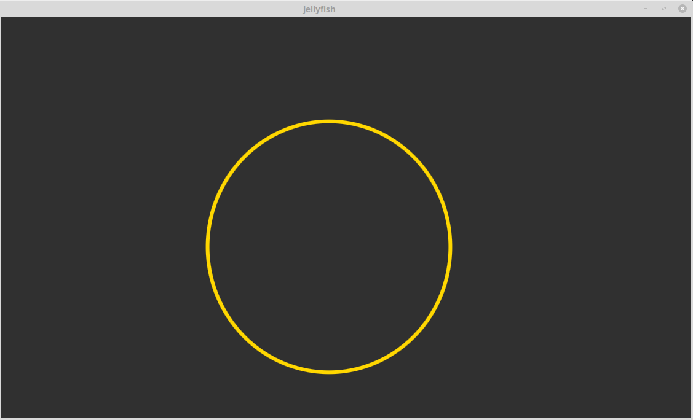

# Jellyfish animation
A simple JavaFX application that shows an ellipse moving with a wobbling animation, just like a jellyfish seen from
 above!

## Intro
The axes of the ellipse are animated using the following formulas:

 

whereas the center moves randomly.
 

## Requirements
* Java 13 (but can be run since Java 11)
* Maven

## Compile
`mvn compile`

## Run
`mvn javafx:run`

## TODOs
* Configurable parameters
